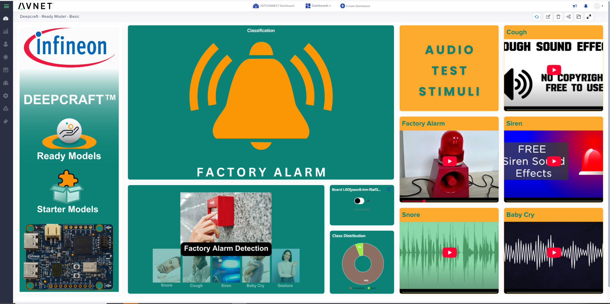

## 1. Introduction
This document outlines the steps of setting up the Infineon PSoC™ 6 Imagimob Ready Model project on the supported boards.

## 2. Prerequisites
This guide has been tested with the following:
* PC with Windows 10/11
* USB-A to USB-C data cable
* WiFi Network with Internet access
* A serial terminal application such as [Tera Term](https://sourceforge.net/projects/tera-term/) (Recommended) or a browser-based version such as [Google Chrome Labs Serial Terminal](https://googlechromelabs.github.io/serial-terminal/)
* A registered [myInfineon Account](https://www.infineon.com/sec/login)
* One of the following hardware setups:
1) PSoC&trade; 6 Artificial Intelligence Evaluation Kit (CY8CKIT-062S2-AI) [Buy Now](https://www.avnet.com/shop/us/products/infineon/cy8ckit-062s2-ai-3074457345659496631/)
2) PSoC&trade; 62S2 Wi-Fi Bluetooth&reg; Pioneer Kit (CY8CKIT-062S2-43012) [Buy Now](https://www.avnet.com/shop/us/products/infineon/cy8ckit-062s2-43012-3074457345644457809) AND [SHIELD_XENSIV_A](https://www.infineon.com/cms/en/product/evaluation-boards/shield_xensiv_a/) sensor shield

## 3. Hardware Setup
* **PSoC 6 AI Kit:** Connect your PC to the **J1** USB header on the board. A new USB device should be detected.
* **Pioneer Kit:** Connect the SHIELD_XENSIV_A board to the arduino connector. Use the right-side USB-C connector on 062S2-AI and the USB connector on the shorter edge of the 062S2-43012.

## 4. Flash the Firmware
* **Download** and **Install** the latest (tested with v5.2) [ModusToolbox Programming Tools](https://softwaretools.infineon.com/tools/com.ifx.tb.tool.modustoolboxprogtools) (Right-Click, "Open link in new tab")
* **Download** and **unzip** the pre-compiled [avnet-iotc-mtb-ai-imagimob-rm-v1.0.0.zip](https://downloads.iotconnect.io/partners/infineon/demos/avnet-iotc-mtb-ai-imagimob-rm-v1.0.0.zip) firmware package.
The package will contain several .hex files with the board name as the prefix and model type as suffix. 
* Launch the **ModusToolbox Programmer** software and update the firmware if prompted.
* Next to the **Programmer** drop-down, ensure the item beginning with **KitProg3** is selected
* Click the dropdown box next to **Board** and select the **CY8CKIT-062S2-AI** or **CY8CKIT-062S2-43012** depending on the board that needs to be programmed.
* Click **File -> Open** and select the corresponding firmware .hex file downloaded.
For example, if trying out the *Siren* model using the CY8CKIT-062S2-AI, select the ```062S2-ai-imagimob-rm-siren.hex```.
* Click **Connect**.
* Click **Program**.
* Wait for the "Device programmed successfully" message to appear at the bottom.
* **Close** the programmer.

## 5. Serial Port Setup
* Launch the Serial Terminal application (TeraTerm)
* If using TeraTerm, it's recommended you enable `Local Echo` in the "Setup" -> "Terminal" menu, otherwise text input will not be visible.
* Configure settings as shown below:
  * Port: (Select the COM port with the device)
  * Speed: `115200`
  * Data: `8 bits`
  * Parity: `none`
  * Stop Bits: `1`
  * Flow Control: `none`
  * In the Transmit Delay section of the serial port setting, enter 10 for both per-character and per-line delay. 
* After setup, connect and reset the board.

## 7. Cloud Account Setup
An /IOTCONNECT account with AWS backend is required.  If you need to create an account, a free trial subscription is available.
The free subscription may be obtained directly from iotconnect.io or through the AWS Marketplace.

* Option #1 [/IOTCONNECT via AWS Marketplace](https://github.com/avnet-iotconnect/avnet-iotconnect.github.io/blob/main/documentation/iotconnect/subscription/iotconnect_aws_marketplace.md) **(Recommended)** - 60 day trial; AWS account creation required
* Option #2 [/IOTCONNECT via iotconnect.io](https://subscription.iotconnect.io/subscribe?cloud=aws) - 30 day trial; no credit card required

> [!NOTE]
> Be sure to check any SPAM folder for the temporary password after registering.

See the /IOTCONNECT [Subscription Information](https://github.com/avnet-iotconnect/avnet-iotconnect.github.io/blob/main/documentation/iotconnect/subscription/subscription.md) for more details on the trial.

## 8. Acquire /IOTCONNECT Account Information
Login to /IOTCONNECT using the using the link below:  
[https://console.iotconnect.io](https://console.iotconnect.io)

The Company ID (**CPID**) and Environment (**ENV**) variables identifying your /IOTCONNECT account must be configured for the device.
* Take note of these values for later reference located in the "Settings" -> "Key Vault" section of the platform. See image below.


## 9. Configure the Board

> [!IMPORTANT]  
> There is no local echo in the serial terminal when typing or pasting values (unless you enabled this option in the TeraTerm settings).
> If a mistake is made, the board must be reset and this section repeated.

* Verify the following output is visible in the terminal:  `Please enter your device configuration`
* If not, reset the board.

> [!NOTE] 
> To change an existing configuration reset the board and press `y` and then `ENTER` when prompted.

* Enter the **Platform** for which you subscribed: `aws` (for AWS) or `az` (for Azure)
* Enter the **CPID** acquired from the key vault in Step 8
* Enter the **ENV** (Environment) acquired from the key vault in Step 8
* Enter your **WiFi SSID**
* Enter your **WiFi Password**

The device will configure itself and reboot.

The application will display the auto-generated certificate from flash upon boot.

> [!CAUTION]  
> This certificate will be re-generated every time you re-flash the board because the flash section
> where the certificate and private key are stored will be erased.
> In this case, you will need to delete your device from /IOTCONNECT and re-create the device with the new certificate.
> If you wish to avoid this, you should use the Developer Guide and 
> have your device credentials compiled into the application.

* **Copy** the *Device Certificate* from the terminal including the "BEGIN" and "END" lines.
* Open a text editor, such as notepad, paste in the certificate, and save the file as `cert.txt`
  ```
  -----BEGIN CERTIFICATE-----
  MIIB9TCCAXygAwIBAgIEOi/kbTAKBggqhkjOPQQDAzByMQswCQYDVQQGEwJERTEh
  MB8GA1UECgwYSW5maW5lb24gVGVjaG5vbG9naWVzIEFHMRMwEQYDVQQLDApPUFRJ
  R0EoVE0pMSswKQYDVQQDDCJJbmZpbmVvbiBPUFRJR0EoVE0pIFRydXN0IE0gQ0Eg
  MzAwMB4XDTIwMDkxMDExNDAyNFoXDTQwMDkxMDExNDAyNFowGjEYMBYGA1UEAwwP
  SW5maW5                                        DAQcDQgAEAk4GXqVj
  YoNVwYj        EXAMPLE ONLY - DO NOT USE       rFqQAo9dd4ttDC29p
  XBmgkaW                                        dEwEB/wQCMAAwFQYD
  VR0gBA4wDDAKBggqghQARAEUATAfBgNVHSMEGDAWgBSzg+GsVpQGWa/Yr1cheEV0
  jgxJmTAKBggqhkjOPQQDAwNnADBkAjAmOrOHHkxAobTfFfmMZAL21BtOF111Rpkp
  /f0sFWNSf4/lxPtE1TJ3DUlMZ3qmtSMCMHPCHRv3rklr9jiIJ4GTKIGuy1d04NUH
  Ma0O+81heMCpsb9j/6/7ucw9iGVRpykvug==
  -----END CERTIFICATE-----
  ```
* **Copy** the Device Unique ID *(DUID)* from the terminal and save for later use.

* Ensure the device is able to connect to the WiFi network, obtain an IP address, and get updated time from an NTP server. 
The following output should be visible in the serial terminal:

```
Successfully connected to Wi-Fi network '<network name>'.
IPv4 Address Assigned: <IP Address>
Obtaining network time......
Time received from NTP.
```

There will be errors displayed because the device still needs to be created in the /IOTCONNECT platform. Ignore the errors and continue to the next section.

## 10. /IOTCONNECT Device Template Setup

An /IOTCONNECT *Device Template* will need to be created or imported. This defines the data format the platform should expect from the device.
* Download the premade  [Device Template](files/psoc6airm-device-template.json?raw=1) (**must** Right-Click the link, Save As)

* **Click** the Device icon and the "Device" sub-menu:  


* At the bottom of the page, select the "Templates" icon from the toolbar.<br>
* At the top-right of the page, select the "Create Template" button.<br>
* At the top-right of the page, select the "Import" button.<br>
* Finally, click the "Browse" button and select the template previously downloaded.

## 11. /IOTCONNECT Device Creation
* **Click** the Device icon and the "Device" sub-menu:  


* At the top-right, click on the "Create Device" button:  


* Enter the **DUID** saved from earlier in the *Unique ID* field
* Enter a description of your choice in the *Display Name* to help identify your device
* Select the template from the dropdown box that was just imported ("psoc6airm")
* Ensure "Use my certificate" is selected under *Device certificate*
* Browse and Select the "cert.txt" file saved in Step 6
* Click **Save & View**

## 12. Verify Connection and Data

* Switch to the Serial Terminal application windows
* Press the *Reset* button on the board
* After a few seconds, the device will connect, and begin sending telemetry packets similar to the example below:

```
Detected snore
Detected snore
>: {"d":[{"d":{"version":"N-01.00.00","random":32,"class":"snore"}}]}
>: {"d":[{"d":{"version":"N-01.00.00","random":61,"class":"not-detected"}}]}
```

* Switch back to the /IOTCONNECT GUI in your browser and **Click** "Live Data" on the left Device menu and verify telemetry is being populated.

## 13. Import the Dashboard
* Download the demo [Dashboard Template](files/ReadyModel_MTB_Project_dashboard_export.json?raw=1) (**must** Right-Click, Save As)
* **Download** the template then select `Create Dashboard` from the top of the page
* **Select** the `Import Dashboard` option and click `browse` to select the template you just downloaded.
* **Select** `psoc6airm` for **template** and `<your DUID>` for **device** 
* **Enter** a name (such as `PSoC6 AI Kit Demo`) and click `Save` to complete the import



## 14. Demonstrating Cloud-to-Device Communication
/IOTCONNECT supports sending commands from the platform back to the device. Using the "Device Command" widget, a command to toggle an LED ON/OFF from the /IOTCONNECT Dashboard.

## 15. Application Examples / Use-cases
See see some examples of how these models can be used with /IOTCONNECT to solve real-world solutions, explore the application examples in the [files](files/) directory.

## 16. Resources
* [Webinar Slides](files/Infineon-PSOC6-AI-Use-Cases-Apr2025.pdf)
* [DEEPCRAFT Orderable Part Numbers](DEEPCRAFT_ready_model_orderable.pdf)
