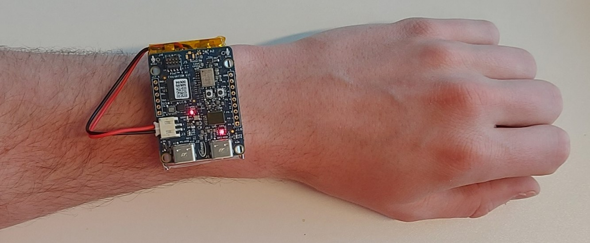

# Fall Detection with DEEPCRAFT™ and IoTConnect (IMU)

## Scenario
An assisted living facility operates a centralized control center equipped with IoTConnect, monitoring multiple fall detection devices worn by residents. Each device uses Imagimob's DEEPCRAFT™ Edge AI model to accurately detect falls in real-time. When a fall is detected, the device immediately transmits the incident to the IoTConnect platform. The centralized dashboard then triggers alerts and notifications to caregivers instantly, allowing prompt response and assistance. The facility management team can oversee all incidents, manage devices remotely, and continuously optimize fall detection performance through easy retraining and rule adjustments, ensuring maximum safety for residents.

## IoTConnect Features
- **Real-time Alerting**: Instant notifications to caregivers when a fall is detected.
- **Centralized Device Monitoring**: Unified dashboard for tracking the status of all deployed devices.
- **Event Logging and Analysis**: Comprehensive logging of fall incidents, device activities, and triggered responses.
- **Cloud-Based Rules and Automation**: Automated triggering of alerts, responses, and escalations based on configured rules.

## AI Evaluation Kit Testing Instructions

The DEEPCRAFT™ model is tailored to detect dangerous falls among elderly people and performs best on unpadded falls. For optimal results, it's recommended to test with a healthy adult and use pillows to avoid injury. The model is designed with very low false positives per user per week, provided the person lays still for 7-10 seconds after the fall event.

### IMU Orientation
Ensure the IMU (Inertial Measurement Unit) orientation matches the accelerometer X, Y, Z axes:

- **Bird’s eye view**: Arm flat on table
- **Y = 1, X = 0, Z = 0**: Hand held up
- **X = -1, Y = 0, Z = 0**: Hand outstretched, palm facing front
- **Z = -1, X = 1, Y = 0**: Hand outstretched, palm up

## IoTConnect Device Rules
Use IoTConnect rules to manage notifications and responses:

- **Rules List**: Configure rules to handle specific incidents, such as "Fall Detected" or "Device Disconnected."
- **Notification Setup**: Customize notifications via email, push notifications, webhook, or UI alerts based on triggered events.

## Getting Started

1. Ensure your device is onboarded by following the [Quickstart Guide](https://github.com/avnet-iotconnect/avnet-iotc-mtb-ai-imagimob-rm/blob/main/QUICKSTART.md).
2. Import the Fall Detection dashboard (`dashboard.json`) from this folder into your IoTConnect environment.
3. Configure and activate IoTConnect device rules as described above.
4. Perform AI Evaluation Kit Testing following the instructions provided to ensure accuracy and optimal performance.

For additional details or troubleshooting, refer to the main [Avnet IoTConnect Imagimob AI Examples README](../README.md).

