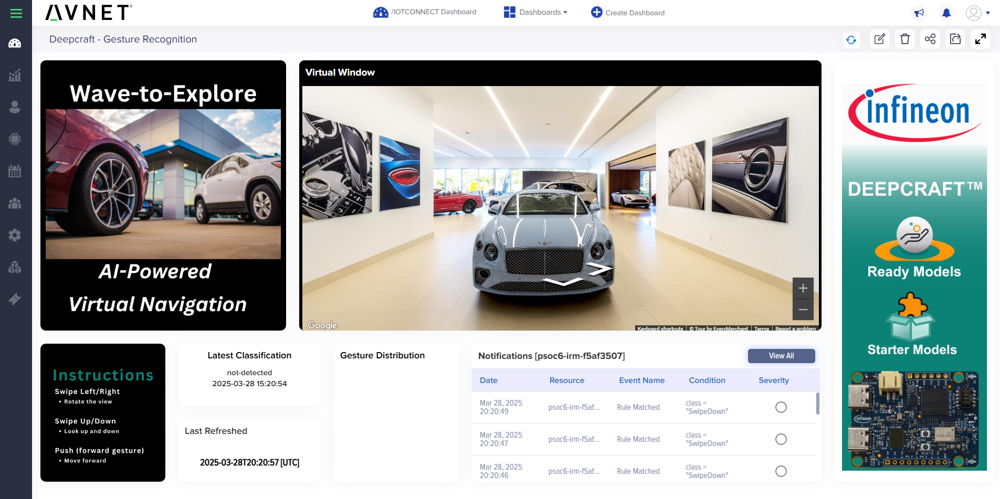

# Smart Retail: Gesture-Controlled Virtual Showroom with DEEPCRAFT™ and /IOTCONNECT (Radar)

## Background
Today's retail customers seek engaging, interactive ways to explore products remotely or at in-store kiosks. The Imagimob DEEPCRAFT™ Gesture Recognition Model detects user gestures—swiping left/right, up/down, and pushing forward—and translates them into intuitive virtual navigation commands. Integrated with /IOTCONNECT, these gestures dynamically control a Google Street View-based virtual showroom, enabling remote exploration of products or vehicle displays.

The gesture technology operates as a standalone IoT device, flexibly placed throughout retail environments without needing an attached screen. Sales staff receive instant notifications, gaining immediate insights into customer interactions, enabling proactive engagement with personalized recommendations. The dashboard updates via transformation widgets, displaying recognized gestures and triggered webhooks. /IOTCONNECT logs interactions, remotely updates navigation start points, and provides analytics to optimize showroom layouts and enhance customer experiences.

## Getting Started
1. Follow the onboarding steps outlined in the [Quickstart Guide](https://github.com/avnet-iotconnect/avnet-iotc-mtb-ai-imagimob-rm/blob/main/QUICKSTART.md) to ensure device setup.
2. Import the Gesture Detection dashboard (`retail_gesture_dashboard.json`) from this folder into your /IOTCONNECT environment.
3. Set up /IOTCONNECT device rules to automate notifications and manage gestures effectively.
4. Refer to the [AWS Webhook Setup](https://github.com/avnet-iotconnect/avnet-iotc-mtb-ai-imagimob-rm/blob/main/files/gesture-detection/gesture-controlled_viewer_setup.md) document to enable webhook interactions.
5. Validate gesture detection performance using Infineon’s BGT60TR13C radar sensor.

For additional information or troubleshooting, refer to the main [Avnet /IOTCONNECT Imagimob AI Examples README](../README.md).

## Technical Specifications
- **Gesture Detection**: Identifies 5 distinct gestures lasting 1-2 seconds each.
- **Accuracy**: Detects approximately 92% of gestures within 10 cm – 70 cm from the radar.
- **Robustness**: Effective across varying heights, speeds, distances, and angles, and resistant to unintended hand movements.
- **Expansion Capability**: Can be further developed for additional gesture recognition.

## Model Specifications
- **Platform Optimization**: Runs real-time on Infineon PSOC™ 6 integrated with the XENSIV™ BGT60TR13C radar sensor.
- **Memory Footprint**: RAM: 3 kB, Flash: 45 kB.
- **Inference Time**: 8 ms, every 91 ms.
- **Sensor Data Inputs**: Processes radar data—range, velocity, azimuth, elevation, and magnitude at 33 Hz.

## Possible Use Cases
- Contactless control of computer monitors, household appliances, and other electronic devices.
- Sleek, button-free user interface designs.

## /IOTCONNECT Features
- **Remote Interaction Control**: Navigate virtual environments through intuitive IoT-based gestures.
- **Event Tracking and Logging**: Records user gestures, interactions, and system responses.
- **Sales Personnel Notifications**: Real-time alerts to enhance customer engagement.
- **Cloud-Based Webhooks**: Automated cloud responses dynamically adjust virtual showroom navigation.

## AWS Webhook Setup
To configure AWS infrastructure for handling /IOTCONNECT webhook notifications, refer to the [Gesture-Controlled Viewer AWS Setup Instructions](https://github.com/avnet-iotconnect/avnet-iotc-mtb-ai-imagimob-rm/blob/main/files/gesture-detection/gesture-controlled_viewer_setup.md).

## /IOTCONNECT Device Rules
To effectively manage gestures in your Smart Retail environment, follow these steps to create device rules in /IOTCONNECT:

### Step-by-Step Instructions

1. **Navigate to the Device List**:
   - Log in to your /IOTCONNECT account.
   - Go to **Devices** → **Device List**.

2. **Create a Rule**:
   - Scroll to the bottom of the device list page and select **Rules**.
   - Click on **Create Rule**.

3. **Configure Rule Details**:
   - Enter the **Rule Name** (e.g., SwipeDown Notification).
   - Select your applicable **Template**.
   - Choose **Severity** based on your notification preferences.
   - Under **Attribute**, select **class**.
   - Set condition to **is equal to**.
   - Enter the corresponding gesture value from the table below:

    | Gesture Name | Attribute (`class`) Value |
    |--------------|----------------------------|
    | Swipe Down   | SwipeDown                  |
    | Swipe Up     | SwipeUp                    |
    | Swipe Left   | SwipeLeft                  |
    | Swipe Right  | SwipeRight                 |
    | Push         | Push                       |

4. **Select Device, Entity, or Device Group**:
   - Choose the device(s), entity, or device group the rule will apply to.

5. **Set up Webhook Notifications**:
   - Under the **Notifications** section, select **Webhook**.
   - Insert your webhook URL (e.g., `https://05eimjdvv0.execute-api.us-east-1.amazonaws.com/prod/setgesture`).
   - Note: Replace the example URL with your own, as the provided URL may be taken down in the future.

6. **Add Header Information**:
   - Enter the **Header Key** and **Header Value** as required by your webhook endpoint.
   - Example provided below:

    | Header Key | Header Value |
    |------------|--------------|
    | gesture    | down         |
    | gesture    | up           |
    | gesture    | left         |
    | gesture    | right        |
    | gesture    | push         |

Repeat this process to create rules for each gesture, ensuring each gesture is correctly configured based on the table provided above.
