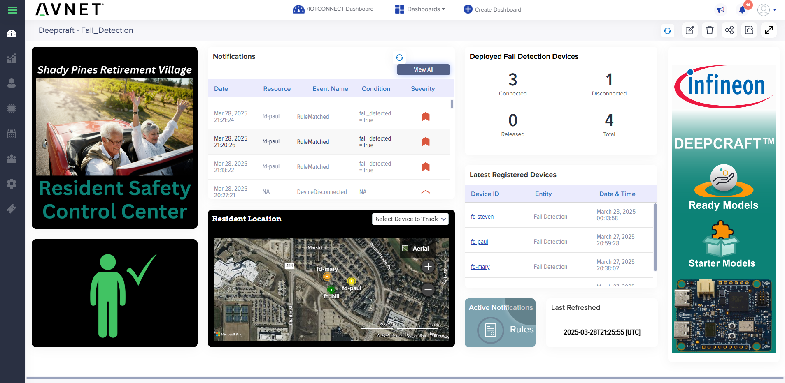

# Avnet IoTConnect Imagimob AI Examples

This directory contains example dashboards and supporting files for three distinct AI demonstrations using Imagimob Edge AI integrated with Avnet IoTConnect. Each subdirectory includes the specific dashboard JSON file for import into IoTConnect, images illustrating the respective dashboards, and detailed instructions for using each example.

## Examples

### 1. [Factory Alarm Detection](https://github.com/avnet-iotconnect/avnet-iotc-mtb-ai-imagimob-rm/tree/main/files/factory-alarm)
- **Purpose**: Detect specific factory alarms using audio recognition.
- **Dashboard File**: `factory-alarm/dashboard.json`
- **Usage Instructions**: See the `README.md` within the `factory-alarm` directory for step-by-step guidance.

### 2. [Fall Detection](https://github.com/avnet-iotconnect/avnet-iotc-mtb-ai-imagimob-rm/tree/main/files/fall-detection)
- **Purpose**: Identify fall events using accelerometer data to assist in elder care or hazardous environments.
- **Dashboard File**: `fall-detection/dashboard.json`
- **Usage Instructions**: See the `README.md` within the `fall-detection` directory for detailed setup and operational instructions.

### 3. [Gesture Detection](https://github.com/avnet-iotconnect/avnet-iotc-mtb-ai-imagimob-rm/tree/main/files/gesture-detection)
- **Purpose**: Recognize and interpret hand gestures for interactive control.
- **Dashboard File**: `gesture-detection/dashboard.json`
- **Usage Instructions**: See the `README.md` within the `gesture-detection` directory for complete instructions.

## Getting Started
Before using these example dashboards, you must:

1. Complete the onboarding process outlined in the [Quickstart Guide](https://github.com/avnet-iotconnect/avnet-iotc-mtb-ai-imagimob-rm/blob/main/QUICKSTART.md).
2. Import the relevant dashboard (`dashboard.json`) into your IoTConnect environment from the respective example folder.
3. Follow any additional setup or operational instructions provided in each subdirectory's `README.md`.

Ensure all prerequisites from the Quickstart Guide are met before proceeding with dashboard imports.

