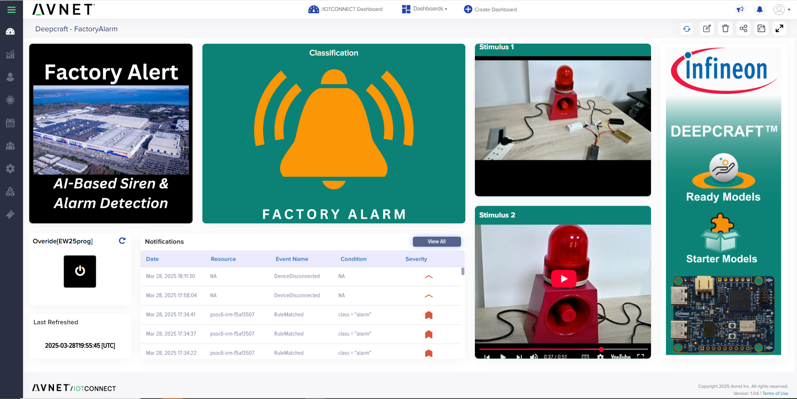
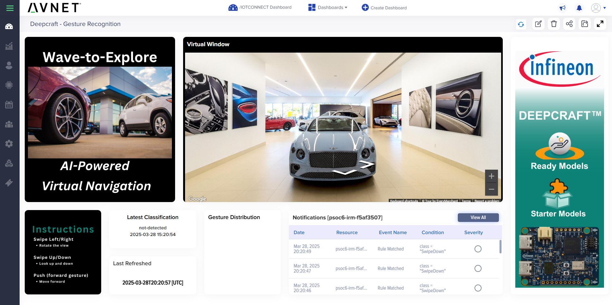

# Avnet /IOTCONNECT Imagimob Deepcraft AI Use-Case Examples

This directory contains example dashboards and supporting files for three distinct AI demonstrations using Imagimob Edge AI integrated with Avnet /IOTCONNECT. Each subdirectory includes the specific dashboard JSON file for import into /IOTCONNECT, images illustrating the respective dashboards, and detailed instructions for using each example.

## Getting Started
Before using these example dashboards, you must:

1. Complete the onboarding process outlined in the [QuickStart Guide](https://github.com/avnet-iotconnect/avnet-iotc-mtb-ai-imagimob-rm/blob/main/QUICKSTART.md).
2. Import the relevant dashboard (`dashboard.json`) into your /IOTCONNECT environment from the respective example folder.
3. Follow any additional setup or operational instructions provided in each subdirectory's `README.md`.

Ensure all prerequisites from the QuickStart Guide are met before proceeding with dashboard imports.

## Examples

### 1. [Factory Alarm Detection](https://github.com/avnet-iotconnect/avnet-iotc-mtb-ai-imagimob-rm/tree/main/files/factory-alarm)
- **Purpose**: Automatically recognize and alert users to critical factory alarms by analyzing audio signals, enhancing industrial safety and response efficiency.
- **Deepcraft Ready Model**: Factory Alarm and Siren Detection
- **Dashboard File**: `factory-alarm/dashboard.json`
- **Usage Instructions**: See the `README.md` within the `factory-alarm` directory for step-by-step guidance.

### 2. [Fall Detection](https://github.com/avnet-iotconnect/avnet-iotc-mtb-ai-imagimob-rm/tree/main/files/fall-detection)
- **Purpose**: Accurately detect fall events using accelerometer-based AI models, providing crucial support in elderly care settings or hazardous work environments.
- **Deepcraft Ready Model**: [Fall Detection](https://github.com/avnet-iotconnect/avnet-iotc-mtb-ai-fall-detection)
- **Dashboard File**: `fall-detection/dashboard.json`
- **Usage Instructions**: See the `README.md` within the `fall-detection` directory for detailed setup and operational instructions.

  

### 3. [Gesture Detection](https://github.com/avnet-iotconnect/avnet-iotc-mtb-ai-imagimob-rm/tree/main/files/gesture-detection)
- **Purpose**: Interpret and respond to hand gestures using machine learning, enabling intuitive, hands-free interaction for various IoT applications.
- **Deepcraft Ready Model**: Gesture Detection
- **Dashboard File**: `gesture-detection/dashboard.json`
- **Usage Instructions**: See the `README.md` within the `gesture-detection` directory for complete instructions.

